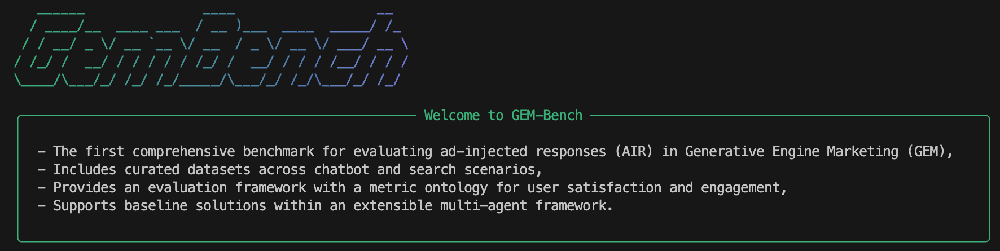

# GEM-BENCH

[](LICENSE)[](https://www.python.org/downloads/)[](https://kdd2026.kdd.org/)[](https://doi.org/10.1145/3770855.3817474)





This repository provides a complete benchmark for **Generative Engine Marketing (GEM)**, an emerging field that focuses on monetizing generative AI by seamlessly integrating advertisements into Large Language Model (LLM) responses. Our work addresses the core problem of **ad-injected response (AIR) generation** and provides a framework for its **evaluation**.

🎉GEM-BENCH has been accepted to [KDD '26](https://kdd2026.kdd.org/) in Jeju, Korea. See the [paper](https://arxiv.org/abs/2509.14221) and [DOI](https://doi.org/10.1145/3770855.3817474).

* **Generative Engine Marketing (GEM):** A new ecosystem where relevant ads are integrated directly into responses from generative AI assistants, such as LLM-based chatbots.
* **Ad-injected Response (AIR) Generation:** The process of creating responses that seamlessly include relevant advertisements while maintaining a high-quality user experience and satisfying advertiser objectives.
* **GEM-BENCH:** The first complete benchmark designed for the generation and evaluation of ad-injected responses.

---

## 📋 Table of Contents

- [Installation](#installation)
- [Getting Started](#getting-started)
- [Command Line Interface](#command-line-interface)
- [Agent Skill](#agent-skill)
- [Available Datasets](#available-datasets)
- [Evaluation Methods](#evaluation-methods)
- [Supported Solutions](#supported-solutions)
- [License](#license)

---

## 🔧 Installation

### Prerequisites

- Python 3.12 or higher
- Conda (recommended for environment management)

### Setup

```bash
# Clone the repository
git clone https://github.com/Generative-Engine-Marketing/GEM-Bench.git
cd GemBench

# Create and activate conda environment
conda create --name GemBench python=3.12
conda activate GemBench

# Install Project
pip install -e .
````

### Environment Configuration

Create a `.env` file in the root directory with the following variables:

```
# Please fill in your own API keys here and change the file name to .env
OPENAI_API_KEY="<LLMs API Key>"
BASE_URL="<LLMs Base URL>"

TRANSFORMERS_OFFLINE=1 # Enable offline mode for Hugging Face Transformers
HF_HUB_OFFLINE=1 # Enable offline mode for Hugging Face Hub

# Embedding
EMBEDDING_API_KEY="<Embedding API Key>"
EMBEDDING_BASE_URL="<Embedding Base URL>"

# Judge model, optional. Falls back to OPENAI_API_KEY and BASE_URL when unset.
JUDGE_API_KEY="<Judge API Key>"
JUDGE_BASE_URL="<Judge Base URL>"

# Optional custom model pricing table for ModelPricing and the gembench CLI.
GEMBENCH_MODEL_PRICE_FILE="~/.gembench/model_prices.json"
```

-----

## 🚀 Getting Started

After setting up your environment and configuration, you can run the main script to reproduce the experiments from our paper.

```bash
python paper.py
```

To modify the evaluation, edit the `paper.py` file to adjust the `data_sets`, `solutions` dictionary, and `model_name`/`judge_model` parameters.

-----

## Command Line Interface

GemBench ships with a `gembench` CLI for production-style ad injection workflows:

```bash
# Validate a custom ad library
gembench ads validate ads.json

# Generate an ad-injected response for an external query
gembench inject --ad-file ads.json --query "What should I pack for a winter trip to Korea?"

# Batch external queries from a text, JSON, or JSONL file
gembench inject --ad-file ads.json --query-file queries.jsonl --method rag-adchat --output results.jsonl --jsonl

# Score external-query results with lightweight production metrics
gembench score results.jsonl
gembench score results.jsonl --matrix has_ad --matrix price --output scores.json
gembench report scores.json

# Run semantic or judge-model metrics only when their API cost is intended
gembench score results.jsonl --matrix naturalness_evaluation --judge-model gpt-4.1-mini --output scores.json

# Compare scored methods and inspect accepted schemas
gembench compare ad-chat-scores.json rag-adchat-scores.json --baseline ad-chat
gembench schema list

# Inspect built-in methods and run diagnostics
gembench methods list
gembench diagnose
```

The ad library can be a list of product objects, a flat product dictionary, or a category-keyed product dictionary. Each ad should provide at least a `name`; `description`/`desc`, `category`, and `url` are used when available.

Use `gembench run`, `gembench generate`, and `gembench evaluate` for bundled benchmark datasets and paper-style result files. For external production queries, prefer `gembench inject` followed by `gembench score`.

See [`docs/cli-schemas.md`](./docs/cli-schemas.md) and [`examples/production/`](./examples/production/) for input/output schemas and local no-API fixtures.

GemBench also includes an All in One Third Platform model price table. You can inspect it and add project-specific overrides with:

```bash
# List all built-in prices plus custom overrides
gembench pricing list
gembench pricing list --json
gembench pricing list --custom-only

# Inspect one model
gembench pricing get gpt-4o-mini

# Add or replace a custom price. Values are per million tokens by default.
gembench pricing add my-model --input-price 1.5 --output-price 6

# Add a price copied from a provider table that is listed per 1K tokens.
gembench pricing add my-1k-model --input-price 0.0015 --output-price 0.006 --unit per-1k

# Remove a custom override
gembench pricing remove my-model

# Show the custom price file path
gembench pricing path
```

By default, custom prices are stored at `~/.gembench/model_prices.json`. Set `GEMBENCH_MODEL_PRICE_FILE` or pass `--price-file` to use a project-specific JSON file. `ModelPricing` automatically loads the same custom price file at runtime.

The custom JSON format is a simple model-to-price map:

```json
{
  "my-model": [1.5, 6.0, 0]
}
```

-----

## Agent Skill

This repository includes an agent skill at [`skills/gembench/SKILL.md`](./skills/gembench/SKILL.md). Codex, Claude Code, Hermes Agent, OpenCLaw, and compatible coding agents can load the `skills/gembench` folder to reuse the project workflow for setup, pricing, experiments, solution changes, documentation, and validation.

-----

## Available Datasets

The GEM-BENCH benchmark includes three curated datasets that cover both chatbot and search scenarios. You can find their paths within the `paper.py` script.

  * **MT-Human:** Based on the humanities questions from the MT-Bench benchmark, this dataset is suitable for ad injection in a multi-turn chatbot scenario.
  * **LM-Market:** Curated from the LMSYS-Chat-1M dataset, it contains real user-LLM conversations focused on marketing-related topics.
  * **CA-Prod:** Simulates the AI overview feature in search engines using commercial advertising data from a search engine.

-----

## Evaluation Methods

GEM-BENCH provides a multi-faceted metric ontology for evaluating ad-injected responses, covering both **quantitative** and **qualitative** aspects of user satisfaction and engagement. The evaluation logic is located in `evaluation/`.

  * **Quantitative Metrics:**

      * **Response Flow & Coherence:** Measure the semantic smoothness and topic consistency of the response.
      * **Ad Flow & Coherence:** Specifically assess how well the ad sentence integrates with the surrounding text.
      * **Injection Rate & Click-Through Rate (CTR):** Capture the system's ability to deliver ads and user engagement.

  * **Qualitative Metrics:**

      * **User Satisfaction:** Evaluated on dimensions like **Accuracy**, **Naturalness** (interruptiveness, authenticity), **Personality** (helpfulness, salesmanship), and **Trust** (credibility, bias).
      * **User Engagement:** Measured by **Notice** (awareness, attitude) and **Click** (awareness of sponsored links, likelihood to click).

-----

## Supported Solutions

The benchmark provides implementations for several baseline solutions, allowing for flexible experimentation. You can find their configurations and exposed parameters within the `paper.py` file.

  * **Ad-Chat:** An existing solution that integrates ads into the system prompt of the LLM.

      * **Parameters:** `model_name` (default: `doubao-1-5-lite-32k`).

  * **Ad-LLM:** A multi-agent framework inspired by recent work, implemented with different configurations:

      * **GI-R:** **G**enerate and **I**nject with ad **R**etrieval based on the raw response. This is a retrieval-augmented generation (RAG) approach that skips the final rewriting step.
      * **GIR-R:** **G**enerate, **I**nject, and **R**ewrite with ad **R**etrieval based on the raw response.
      * **GIR-P:** **G**enerate, **I**nject, and **R**ewrite with ad **R**etrieval based on the user **P**rompt.
      * **Parameters:** All Ad-LLM solutions expose the `embedding_model` and `ad_retriever` as configurable parameters. The `response_rewriter` and `ad_injector` modules also have internal parameters that can be modified.

  * **RAG-AdChat:** A retrieval-augmented Ad-Chat baseline that uses the Ad-LLM product retriever to select products before prompt-based generation.

-----

## 📖 Citation

If you use GEM-BENCH in your research, please cite our paper:

```bibtex
@inproceedings{hu2026gembench,
  title={GEM-Bench: A Benchmark for Ad-Injected Response Generation within Generative Engine Marketing},
  author={Hu, Silan and Zhang, Shiqi and Shi, Yimin and Xiao, Xiaokui},
  booktitle={Proceedings of the 32nd ACM SIGKDD Conference on Knowledge Discovery and Data Mining V.2 (KDD '26)},
  year={2026},
  address={Jeju Island, Republic of Korea},
  doi={10.1145/3770855.3817474},
  url={https://doi.org/10.1145/3770855.3817474}
}
```

For more information, visit our website: [https://gem-bench.org](https://gem-bench.org), read the [paper](https://arxiv.org/abs/2509.14221), or use the [DOI](https://doi.org/10.1145/3770855.3817474).

-----

## 📄 License

This project is licensed under the Apache-2.0 License - see the [LICENSE](./LICENSE) file for details.
